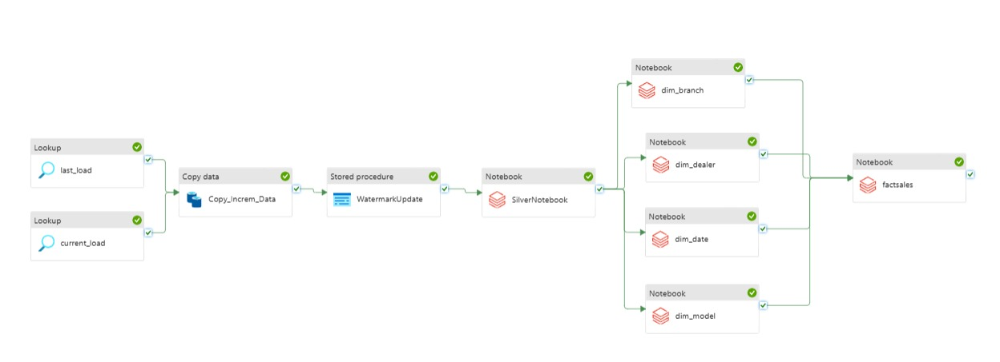

# 🚗 Car Sales End-to-End Data Engineering Project on Azure

This project demonstrates a full-scale **end-to-end data engineering pipeline** implemented on **Microsoft Azure**, tailored for handling **semi-structured car sales data** from ingestion to analytics-ready star schema format. It leverages modern data engineering practices such as the **Medallion Architecture**, **Delta Lake**, **Azure Data Factory**, and **Azure Databricks**, making it job-ready and aligned with real-world enterprise use cases.

---

## 📸 Pipeline Architecture

*End-to-End Azure Data Engineering Pipeline — built with ADF, ADLS Gen2, Databricks, Delta Lake*

---

## 🚀 Tech Stack

- **Azure Data Factory** – Data ingestion & orchestration  
- **Azure Data Lake Gen2** – Storage in Bronze, Silver, and Gold zones  
- **Azure Databricks** – Data transformation using PySpark  
- **Delta Lake** – ACID-compliant analytical storage  
- **Azure SQL / Synapse** – Source system (simulated)  
- **GitHub** – Source code versioning  
- **Parameterized datasets & dynamic pipelines** – Scalable and reusable ETL  

---

## 🏗️ Architecture: Medallion Layer

| Layer      | Description |
|------------|-------------|
| **Bronze** | Raw incremental data in Parquet from SQL source |
| **Silver** | Cleaned and transformed data for dimensional modeling |
| **Gold**   | Fact and dimension tables in star schema using Delta Lake |

---

## 📂 Pipeline Flow

1. **Ingestion (Bronze)**
   - Lookup last watermark & current timestamp
   - Copy only new/updated records from SQL to ADLS in Parquet format
   - Update watermark using stored procedure

2. **Transformation (Silver)**
   - Clean, join, enrich data using PySpark notebooks in Databricks
   - Generate a unified "one big table"

3. **Serving (Gold)**
   - Build dimension tables: `dim_branch`, `dim_dealer`, `dim_model`, `dim_date`
   - Build fact table: `factsales` using surrogate keys and slowly changing dimensions (SCD)
   - All final outputs stored in Delta format

---

## 📊 Business Use Case

This pipeline simulates a real-time **car dealership sales system**, where:
- New sales transactions arrive daily  
- Business needs include dealer performance, car model trends, branch-wise comparison  
- The goal is to provide an **analytics-ready schema** (Star Schema) for BI tools like Power BI/Tableau  

---

## 🛠️ Features

- ✅ Incremental Loading via Parameterized Watermarks  
- ✅ Dynamic Data Factory Pipelines using Parameters  
- ✅ Modular Notebooks per Dimension & Fact  
- ✅ Schema Evolution with Delta Lake  
- ✅ Job orchestration with ADF pipeline + notebooks  
- ✅ Version control via GitHub  

---

## 🧠 Concepts Practiced

- ETL / ELT workflow orchestration  
- Azure Data Factory parameterized datasets  
- Delta Lake time travel and schema enforcement  
- Star schema design and surrogate key handling  
- Slowly Changing Dimensions (SCD Type 1 & 2)  

---

